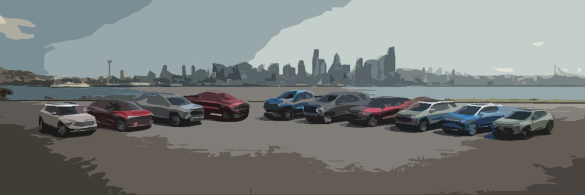

# Automobiles EDA — Executive Fleet Analysis

This project performs a comprehensive exploratory data analysis of the [automobiles dataset](https://github.com/SarennahL-C/pf-automobiles/blob/06f05070a32629ea79a8ecd6d15d77bc4db9f9e6/automobile.txt), framed as an assignment to recommend **environmentally responsible executive cars** that balance cost, emissions, and performance. I approach data analytically and visually, aiming to uncover insights that support decision-making.

I enjoy transforming real-world, messy data into clear visuals and actionable insights — this project reflects that passion.

### What’s in this repository

- **Jupyter Notebook:** step-by-step analysis (`Automobiles_Capstone_Project.ipynb`)  
- **Report:** polished write-up (`EDA_report_Automobile_Dataset.pdf`)  
- **Images:** visuals and reviewer feedback  
- **Requirements:** Python dependencies (`requirements.txt`)

### Skills demonstrated

- Data cleaning & preprocessing with pandas  
- Advanced visualisation with seaborn and matplotlib  
- Correlation and relationship analysis  
- Storytelling with markdown and reports  
- Reproducible Python workflows

### Endorsement

> *“This project goes beyond basic cleaning and visualisation, demonstrating advanced analytical thinking through careful variable selection, correlation analysis, and insightful visualisations.”*

### Requirements

Install dependencies with: `pip install -r requirements.txt`
